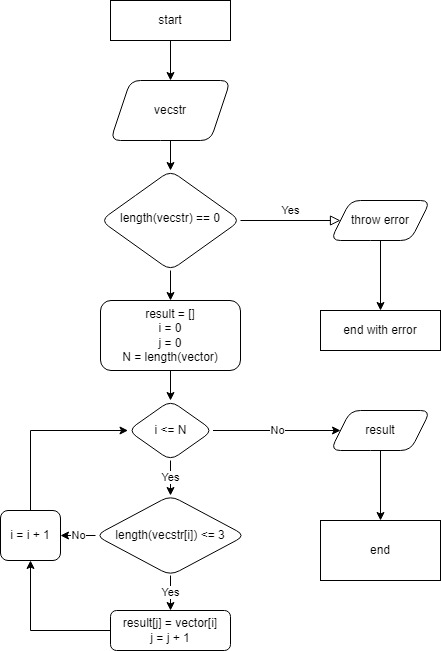

# vecstr
solution for the first intermediate certification
## Task
The task is presented on follwoing [link](https://gbcdn.mrgcdn.ru/uploads/asset/4283449/attachment/1251e74b703108ee483caaa98787097d.png)
## Solution
### Logic
schema

### Program
presented in:
* vec_utils.hpp - header-only for vector in|out
* vecstr.hpp|.cpp - VectorGroomer to operate with vector in task-defined manner
* main.cpp - its main.
#### build
- install cmake/make/gcc
- build ordinary with cmake from root of repo. tested with g++ on windows10 (mingw)
#### usage
go to folder with *vecstr(.exe)* and run
* *./vecstr -h* - to veiw help message
* *./vecstr -i* - to run this in interactive mode (specify length, max length of element and each element)
* *./vecstr -h* - to run this in default mode (vector will be generated and groomed with max length = 3)

